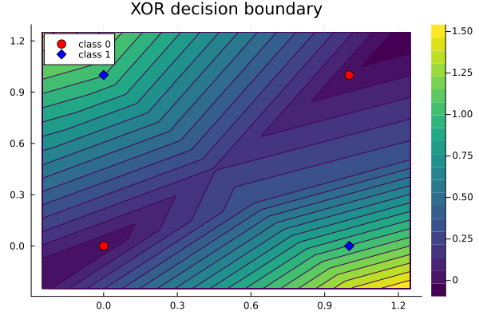

# PicoGrad.jl

A tiny scalar autograd engine in Julia, plus a very small neural networks library on top. Based on Andrej Karpathy’s [micrograd](https://github.com/karpathy/micrograd), this project reimplements the engine in Julia, makes it functional rather than OOP, and adds modest improvements while keeping it concise, simple, and readable.

> Note: This is not a professional project, and is meant for fun and experimentation. It was also used as an educational exercise for me and can also be used like that for anyone curious to read the code. This project is kept intentionally small, concise, simple, and easy to read and understand.

### Getting started

```bash
julia examples/autograd_example.jl   # forward/backward on a scalar expression
julia examples/nn_example.jl         # train XOR with MSE + SGD
```

> Requirements: Julia (1.12 recommended). 

### Example

Below is a short Julia sketch showing the basic usage (mirrored example from micrograd for reference):

```julia
include("src/engine.jl")

a = Value(-4.0)
b = Value(2.0)
c = a + b
d = a * b + b ^ 3
c = c + (c + 1)
c = c + (1 + c + (-a))
d = d + (d * 2 + relu(b + a))
d = d + (3 * d + relu(b - a))
e = c - d
f = e ^ 2
g = f / 2.0
g = g + 10.0 / f


println(g.data) # scalar output of the forward pass (~24.7041)

# Backward pass: populate gradients via autodiff
backward!(g)

# Inspect gradients of inputs
println(a.grad)  # ~138.8338
println(b.grad)  # ~645.5773
```

### Training

`nn_example.jl` trains a tiny MLP on XOR using mean squared error and a simple SGD loop. Run it with:

```bash
julia examples/nn_example.jl
```

### Visualization (optional)

Install Plots.jl once and run any of the scripts:

```julia
using Pkg; Pkg.add("Plots")
julia examples/visualize_decision_boundary.jl   # XOR decision boundary → images/xor_boundary.png
```



### Files

- `src/engine.jl` — scalar `Value`, arithmetic, `relu`, and `backward!` (stack‑based topo).
- `src/nn.jl` — `Neuron`, `Layer`, `MLP`, parameter flattening, and `zero_grad!`.
- `examples/autograd_example.jl` — expression + gradients demo.
- `examples/nn_example.jl` — XOR training demo with MSE + SGD.
- `examples/visualize_decision_boundary.jl` — optional XOR decision boundary plot (requires Plots.jl).

### Notes

- Scalars only. Vectors are plain Julia arrays of `Value`.
- Gradients accumulate across calls, so you need to reset with `zero_grad!`.
- A layer returns a single `Value` when `nout == 1`, otherwise a vector.

### License

MIT

### Thanks

Heavily inspired by Andrej Karpathy's Micrograd, implemented in Julia as an educational exercise.
